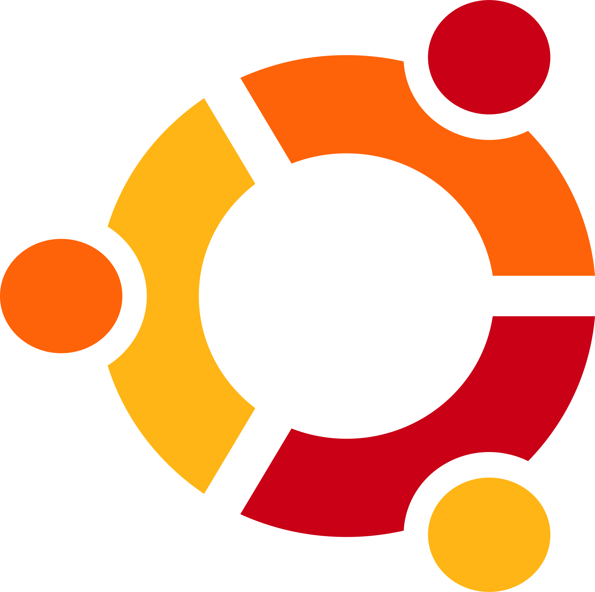

<h2 align="center">:rocket: Welcome to my GitHub Profile! I'm Zach :smile:</h2>

 " src="assets/giphy.webp">  

<h3 align="center">About me</h3>

<strong> Hi! My name’s Zach, academically I’m a 16 year old high school student in college!
 
Beyond schooling, I program for fun and use coding to my advantage as well when I get the chance. </strong>

 

" src="assets/coding.gif">
 

<h3 align="center">:scroll: Languages/Tools :wrench: </h3>

 
&nbsp;&nbsp;

&nbsp;&nbsp;

&nbsp;&nbsp;

&nbsp;&nbsp;

&nbsp;&nbsp;

&nbsp;&nbsp;

&nbsp;&nbsp;

&nbsp;&nbsp;

  

<strong> Interests: </strong>
 data science, artificial intelligence, IT, software development, API’s, and even a little UX/UI design for websites/software

" src="assets/comp.gif">
 
<strong> Learning Focus: </strong>
C/C++, Django, Docker, MySQL 
 
<strong> Plan to Learn/Learning:
</strong> Rust, Javascript, React, AWS, FirebaseSDK
<strong>
 

I'm currently working on a few projects as you can see in my repositories,
 
alongside taking college classes full-time and I enjoy ricing linux on my spare time.
 

I also like dogs :dog:
</strong>

<h3 align="center">:floppy_disk:Operating Systems/Linux Distros:dvd:</h3>

 
&nbsp;&nbsp;

&nbsp;&nbsp;

&nbsp;&nbsp;

&nbsp;&nbsp;

&nbsp;&nbsp;

<h3 align="center">:chart_with_upwards_trend: Stats (May not be up-to-date) :bar_chart: </h3>

 

 

<h3 align="center">:pushpin: Metrics :paperclip:</h3>

![Metrics](https://metrics.lecoq.io/ZachLTech?template=classic&habits=1&stars=1&achievements=1&introduction=1&activity=1&repositories=1&base=header%2C%20activity%2C%20community%2C%20repositories%2C%20metadata&base.indepth=false&base.hireable=false&base.skip=false&repositories.batch=100&repositories.forks=false&repositories.affiliations=owner&stars=false&stars.limit=4&habits=false&habits.from=200&habits.days=14&habits.facts=true&habits.charts=false&habits.charts.type=classic&habits.trim=false&habits.languages.limit=8&habits.languages.threshold=0%25&repositories=false&repositories.featured=Smart-Mouse-Clicker%2C%20PhysicalSizeOfTheInternetSite%2C%20PortfolioLoadingPage&repositories.pinned=0&repositories.starred=0&repositories.random=0&repositories.order=featured%2C%20pinned%2C%20starred%2C%20random&achievements=false&achievements.threshold=C&achievements.secrets=true&achievements.display=detailed&achievements.limit=0&activity=false&activity.limit=5&activity.load=300&activity.days=14&activity.visibility=all&activity.timestamps=false&activity.filter=all&introduction=false&introduction.title=true&config.timezone=America%2FNew_York)

